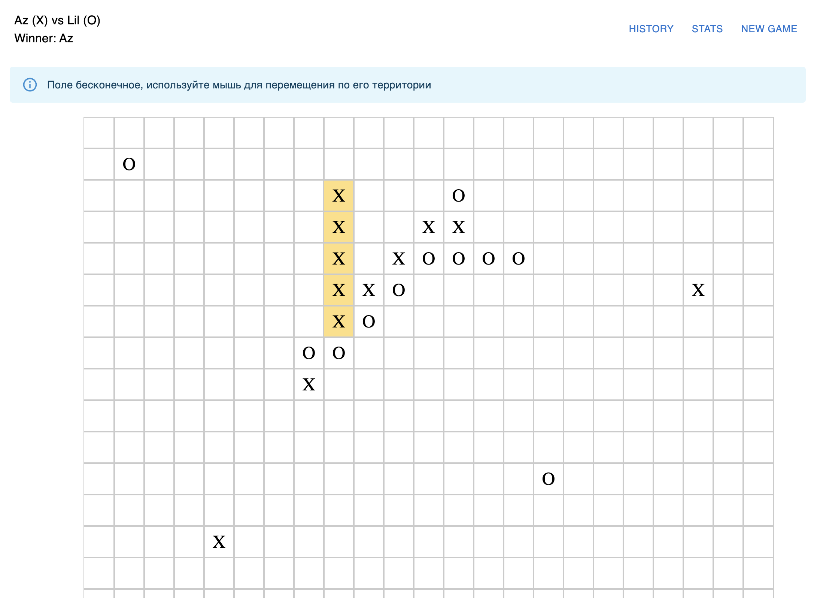

# ♾️ Infinite Tic-Tac-Toe (5 in a Row)

Полноценное приложение на **React + TypeScript**: игра «Крестики-нолики 5 в ряд» на **бесконечном поле** с логином игроков, историей матчей и статистикой.

Проект реализован с упором на **архитектуру, производительность и UX**, на уровне middle+/senior frontend.

---

## 🚀 Возможности

### 🎮 Игра

* Бесконечное игровое поле (infinite board)
* Ходы двух игроков: **X** и **O**
* Победа при **5 одинаковых символах подряд**:

    * по горизонтали
    * по вертикали
    * по диагоналям
* Подсветка победной линии
* Drag & pan поля мышью (как Google Maps)

### 👤 Логин

* Ввод имён двух игроков
* Передача данных между страницами через роутинг

### 📜 История матчей

* Список сыгранных матчей
* Дата, игроки, победитель
* Просмотр финального состояния поля (read-only)

### 📊 Статистика

* Количество игр
* Победы / поражения
* Подсчёт на основе истории матчей

### 💾 Хранение данных

* LocalStorage
* История матчей и статистика сохраняются между перезагрузками

---

## 🧠 Ключевые архитектурные решения

### Infinite Board

* Поле **не хранится как массив**
* Используется структура:

  ```ts
  Map<string, 'X' | 'O'>
  // key = "x:y"
  ```
* Память используется **только под сделанные ходы**

### Камера вместо сдвига поля

* Поле логически бесконечно
* Двигается **камера в пикселях**, а не клетки
* Рендерится только видимая область + buffer

### Проверка победы

* Проверка идёт **только от последнего хода**
* 4 направления × 2 стороны
* O(1) по времени

---

## 🧩 Стек технологий

* **React 18**
* **TypeScript**
* **React Router v6**
* **MUI (Material UI)**
* **LocalStorage**
* HTML5 / CSS3

Без сторонних state-менеджеров.

---

## 🛠 Установка и запуск

### 2️⃣ Установить зависимости

```bash
npm install
```

### 3️⃣ Запустить в dev-режиме

```bash
npm run dev
```

Открой в браузере:

```
http://localhost:5173
```

### 4️⃣ Сборка production

```bash
npm run build
```

---

## 🧪 Как играть

1. Введите имена двух игроков
2. Начните матч
3. Делайте ходы, кликая по клеткам
4. Перетаскивайте поле мышью для перемещения
5. Победа автоматически определяется при 5 в ряд
6. Результат сохраняется в истории

---

## 🎯 Цель проекта

Проект задуман как:

* тестовое задание уровня middle+/senior
* демонстрация архитектурного мышления
* база для дальнейшего развития

---

## ✅ Финальный результат 
показан на скрине ниже:

